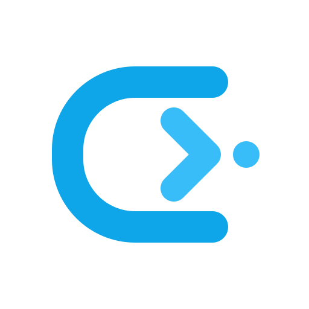

<p align="center">
  
</p>

<h1 align="center">Canywhere</h1>

<p align="center">
  <strong>Decouple local autonomous AI coding assistants from your workstation.</strong><br />
  Control, inspect, and approve coding agents from anywhere — via native iOS and Desktop.
</p>

<p align="center">
  <a href="LICENSE"></a>
  <a href="https://www.rust-lang.org"></a>
  <a href="https://developer.apple.com/swift/"></a>
  <a href="https://tauri.app"></a>
  <a href="https://react.dev"></a>
  <a href="https://bun.sh"></a>
  <a href="https://tailscale.com"></a>
</p>

---

## ⚡ Overview

Terminal-based AI coding agents (such as **OpenAI Codex**, **Google Antigravity `agy`**, **Claude Code**, and **Grok CLI**) require direct workstation access to local filesystems, compilers, language servers, and shell environments. Traditionally, this locks developers to their desk whenever an autonomous task is running.

**Canywhere** decouples the human interaction layer from the workstation execution engine:

* **Host Daemon (Rust + Axum + SQLite WAL)**: Operates on your primary workstation as the **Single Source of Truth (SSOT)**. It manages workspaces, orchestrates CLI agent subprocesses, tracks git status/diffs, handles cryptographic device pairing, and persists session states.
* **Mobile Client (iOS 17+, Native SwiftUI)**: A lightweight, **zero-persistence live remote companion**. Real-time token streaming, workspace file navigation, and remote approval gates with zero local database footprint.
* **Desktop Client (Tauri v2 + React 19 + Tailwind CSS)**: A high-performance native desktop companion sharing the exact same JSON-RPC 2.0 wire protocol as mobile.
* **Multi-Provider CLI Adapter Layer**: Pluggable adapters normalize distinct CLI interaction protocols into unified `AgentEvent` and streaming blocks.

```
┌─────────────────────────────────────────────────────────────────────────────┐
│                             PRIMARY WORKSTATION                             │
│                                                                             │
│  ┌──────────────────────────┐               ┌────────────────────────────┐  │
│  │   Desktop Client (UI)    │               │     iOS Client (Remote)    │  │
│  │    (Tauri v2 / React)    │               │    (SwiftUI / iOS 17+)     │  │
│  └─────────────┬────────────┘               └─────────────┬──────────────┘  │
│                │                                          │                 │
│                │ localhost (WS)        LAN / Tailscale    │                 │
│                │ (JSON-RPC 2.0)        (mDNS + Ed25519)   │                 │
│                └───────────────────┬──────────────────────┘                 │
│                                    ▼                                        │
│  ┌───────────────────────────────────────────────────────────────────────┐  │
│  │                     Canywhere Host Server Daemon                      │  │
│  │  - Axum HTTP & WebSocket Server     - Ed25519 Pairing & Auth Token    │  │
│  │  - SQLite (WAL Mode, rusqlite)      - mDNS Discovery & Tailscale IP   │  │
│  │  - Approval Dispatcher & Guardrails - Git Diff & Branch Engine        │  │
│  └─────────────────────────────────┬─────────────────────────────────────┘  │
│                                    │                                        │
│                      ┌─────────────┴─────────────┐                          │
│                      ▼                           ▼                          │
│           ┌─────────────────────┐     ┌─────────────────────┐               │
│           │    CodexAdapter     │     │     AgyAdapter      │               │
│           └──────────┬──────────┘     └──────────┬──────────┘               │
│                      │ stdio                     │ stdio                    │
│                      ▼                           ▼                          │
│          [codex app-server --stdio]        [agy --serve]                    │
└─────────────────────────────────────────────────────────────────────────────┘
```

---

## ✨ Key Features

* **📱 Zero-Persistence Native iOS App**: Pure SwiftUI with Swift 6 Concurrency (`actor`, `async/await`). Disconnected = cleanly waiting; Connected = zero-lag in-memory streaming. No local database bloat or cache desynchronization.
* **🖥️ Native Desktop Experience**: Built with Tauri v2, React 19, Tailwind CSS v4, Lucide icons, and Shiki code highlighting with full token streaming optimization.
* **🔌 Pluggable CLI Adapters**:
  * **OpenAI Codex**: Deep multiplexed integration with `codex app-server --stdio`, supporting thread startup/resumption, turn steering, and cooperative interruptions.
  * **Google Antigravity CLI (`agy`)**: Multiplexed session orchestration, plan mode detection, and tool call streaming.
  * Extensible architecture for Grok CLI, Claude Code, and custom autonomous agents.
* **🛡️ Zero-Trust Security & Remote Approvals**:
  * Cryptographic pairing using **Ed25519** keypairs and single-use, 5-minute expiry QR codes.
  * Explicit approval dialogs with dangerous command warnings (e.g. `rm -rf`, `sudo`, destructive git commands).
  * Interactive unified diff inspector for patch approval before files are written to disk.
  * Immediate remote device revocation.
* **🌐 LAN & Tailscale Ready**: Automatic local discovery via mDNS / Bonjour and seamless remote mesh networking via Tailscale.
* **📐 Single-Source Schema Contract**: Protocol models are authored in Rust (`crates/canywhere-protocol`) and automatically exported to TypeScript types (`ts-rs`) and Swift Codable models (`quicktype`).

---

## 📂 Repository Topology

```
canywhere/
├── crates/
│   ├── canywhere-protocol/      # Rust protocol definitions & schema generation
│   └── canywhere-server/        # Daemon: Axum, WebSocket, SQLite, CLI Adapters
├── packages/
│   ├── desktop-app/             # Tauri v2 native desktop application wrapper
│   └── desktop-ui/              # React 19 + Tailwind CSS + Radix UI + Zustand (Vite)
├── mobile/
│   └── ios/                     # Native iOS client (Swift 6, SwiftUI, xcodegen)
├── docs/                        # Architecture & interface specifications
│   ├── spec.md                  # Comprehensive technical specification
│   ├── codex-interfaces.md      # OpenAI Codex app-server protocol mapping
│   ├── agy-interfaces.md        # Google Antigravity CLI protocol mapping
│   └── ui-flows.md              # Desktop & mobile interaction flows
├── schemas/                     # Exported JSON schemas for cross-platform codegen
├── scripts/                     # Tooling for Swift codegen and icon synchronization
└── Makefile                     # Unified developer command suite
```

---

## 🚀 Quick Start

### Prerequisites

* **Rust**: `1.80+` (stable toolchain)
* **Bun**: `1.2+` (for scripts and desktop UI builds)
* **Node.js**: `20+` (optional if using Bun)
* **Xcode**: `16.0+` & **xcodegen** (`brew install xcodegen`) for iOS development
* **CLI Assistants**: `codex` and/or `agy` installed and authenticated in your `PATH`

### 1. Clone & Build Everything

```bash
git clone https://github.com/canywhere/canywhere.git
cd canywhere

# Install dependencies and build all targets (Rust + Desktop UI + iOS)
make build
```

### 2. Run the Host Server Daemon

Start the Canywhere host server on `http://127.0.0.1:7890`:

```bash
make server
```

The daemon automatically starts mDNS broadcasting, scans for Tailscale interfaces, and prepares SQLite persistence in `~/.canywhere/canywhere.db`.

### 3. Run Desktop Client

#### Option A: Web UI in Browser (Development)
```bash
make ui-dev
# Open http://localhost:5173
```

#### Option B: Native Desktop Window (Tauri)
```bash
make desktop
```

### 4. Run Mobile Client (iOS)

Generate the Xcode project and build for iOS Simulator:

```bash
make ios-build
```

Or open `mobile/ios/Canywhere.xcodeproj` directly in Xcode, select your physical iPhone or Simulator, and hit **Run** (`Cmd + R`).

Scan the pairing QR code displayed in the Desktop Settings dialog to pair your device over LAN or Tailscale.

---

## 🛠️ Development Cheatsheet

Canywhere includes a standardized `Makefile` to streamline development:

| Command | Description |
| :--- | :--- |
| `make help` | Show all available development targets |
| `make codegen` | Export Rust protocol types to TypeScript and generate Swift models |
| `make check` | Run type checking across TypeScript UI and `cargo check` on Rust workspace |
| `make test` | Run full test suite (Rust unit/integration tests + Vitest UI tests) |
| `make server` | Run the Host Server Daemon |
| `make ui-dev` | Launch Desktop UI Vite development server |
| `make desktop` | Build and run Desktop Tauri application |
| `make ios-project` | Regenerate `Canywhere.xcodeproj` via `xcodegen` |
| `make ios-build` | Build the iOS client for Simulator |
| `make clean` | Clean cargo build artifacts, dist folders, and caches |

---

## 🔒 Security Architecture

Operating a remote control surface into workstation shell execution demands rigorous defenses:

1. **Host as Single Source of Truth**: Mobile devices never hold or execute shell commands directly. They act solely as cryptographic signing and approval terminals.
2. **Ed25519 Cryptographic Handshake**:
   - Pairing tokens are randomly generated 256-bit secrets encoded in QR payloads.
   - Pairing tokens expire after **5 minutes** and are strictly single-use.
   - Paired devices exchange Ed25519 public keys saved in the Host's SQLite store.
3. **Execution Guardrails**:
   - Commands requesting execution display verbatim command strings, resolved working directories, and risk level warnings (`HIGH_RISK` for destructive commands like `rm -rf`, `sudo`, `dd`, `git reset --hard`).
   - File modification requests require visual diff inspection prior to committing changes.
4. **Instant Revocation**:
   - Any paired device can be revoked with a single click from the Desktop UI.
   - Revocation severs active WebSocket connections immediately and blacklists the device public key.

For more details or to report vulnerabilities, please read our [Security Policy](SECURITY.md).

---

## 🤝 Contributing

We welcome contributions from the community! Please read our [Contributing Guidelines](CONTRIBUTING.md) and [Code of Conduct](CODE_OF_CONDUCT.md) before submitting pull requests.

### Core Architectural Invariants:
* **Contract-First**: Never edit generated Swift models (`mobile/ios/Models/Generated/`) or TypeScript types manually. Always edit `crates/canywhere-protocol` and run `make codegen`.
* **Zero Mobile State Desync**: Never introduce local database storage (e.g. SwiftData/CoreData) to the iOS client.
* **Pluggable CLI Adapters**: Core server logic must remain agnostic of specific agent implementations. Implement the `CliAdapter` trait for new assistants.

---

## 📄 License

Canywhere is open-source software licensed under the [MIT License](LICENSE).
